# Computerized Examination Management System 

## Table of Contents

1. [Project Description](#project-description)
2. [Key Objectives](#key-objectives)
3. [Test Creation and Preparation](#test-creation-and-preparation)
    - [Preparing Questions](#preparing-questions)
    - [Exam Preparation](#exam-preparation)
4. [Test Taking](#test-taking)
5. [Test Checking](#test-checking)
6. [Information Processing](#information-processing)
7. [Tools and Frameworks Used](#Tools-and-Frameworks-Used)
8. [Note](#note)

### Project Description

The Computerized Examination Management System is a comprehensive computerized information system designed to centralize and streamline all aspects of test administration within a college environment. Its primary aim is to enhance the efficiency, reliability, and overall management of various types of tests conducted within the institution.

### Key Objectives

The system's key objectives include:

1. **Test Creation and Management:** This system empowers educators and administrators to create tests efficiently. It operates on two levels:
   - **Question Database:** A robust question database allows the storage and organization of questions across diverse fields and subjects.
   - **Test Construction:** Users can easily build tests by selecting questions from the database, creating custom exams tailored to specific courses or topics.

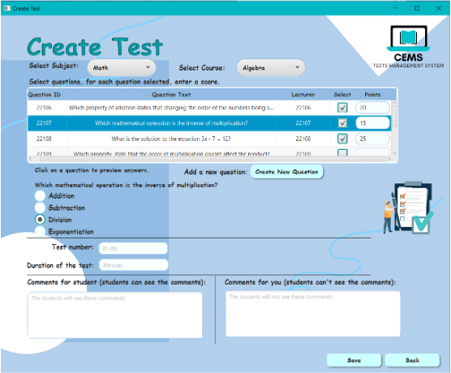

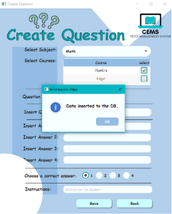

2. **Test Administration:** The system facilitates the administration of tests, offering features such as secure test delivery and monitoring of exam sessions.

3. **Grading and Record Keeping:** After tests are completed, the system automates the grading process and securely records students' grades. This ensures accuracy and consistency in grading.

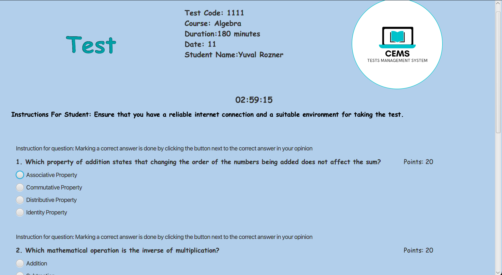

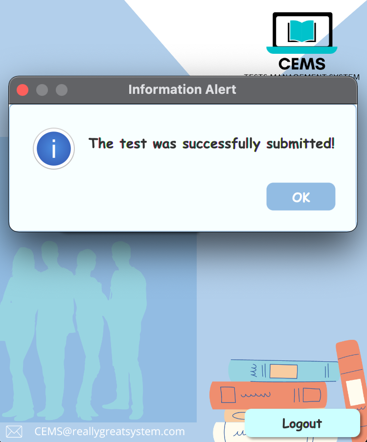

4. **Information Processing:** The system is equipped to handle comprehensive information and data processing, including:
   - **Copy Checking:** Efficiently checking copies, identifying any irregularities, and ensuring the integrity of the assessment process.
   - **Statistical Analysis:** Generating various statistics related to tests, grades, and student performance, enabling educators and administrators to make data-driven decisions.
   - **Information Presentation:** Providing clear and insightful visualizations and reports to aid in understanding and presenting data.

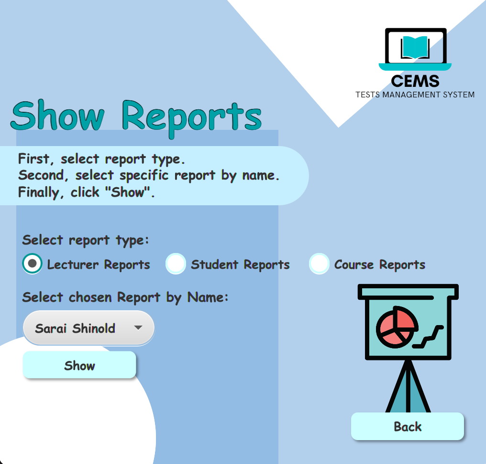

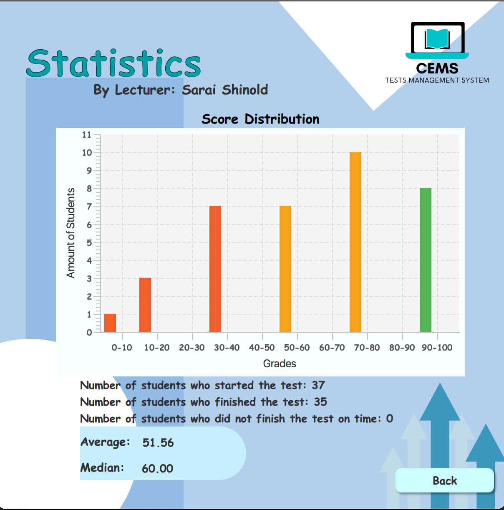

### Test Creation and Preparation

#### Preparing Questions

- Lecturers can create a question bank and a test bank for the subjects they teach.
- Questions include text, instructions, and four answer options, with one marked as correct.
- Each question corresponds to a study subject and one or more courses.
- Questions are uniquely identified by a number (5 digits) and include the lecturer's name.

#### Exam Preparation

- Lecturers construct tests with a unique identifier (6 digits), set a duration, and assign points to each question.
- Tests may include free text instructions for examinees and lecturers.
- The lecturer's name is recorded as the test author.

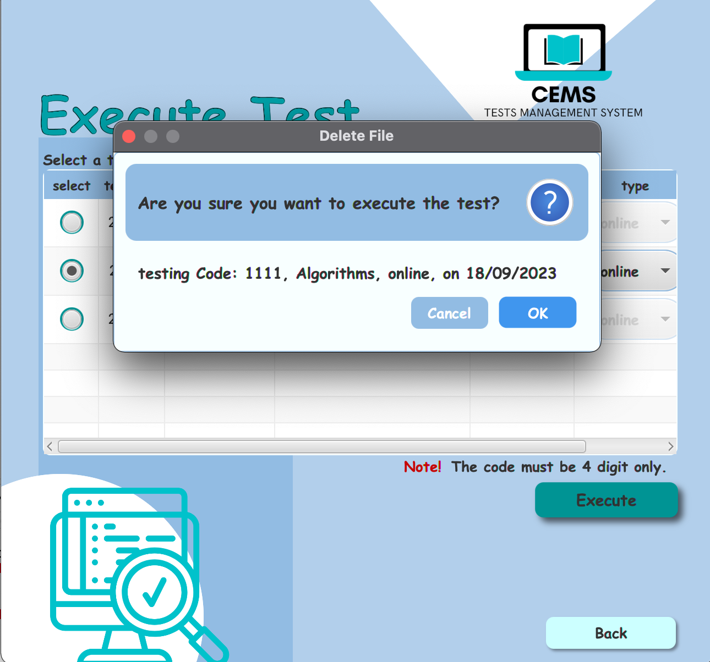

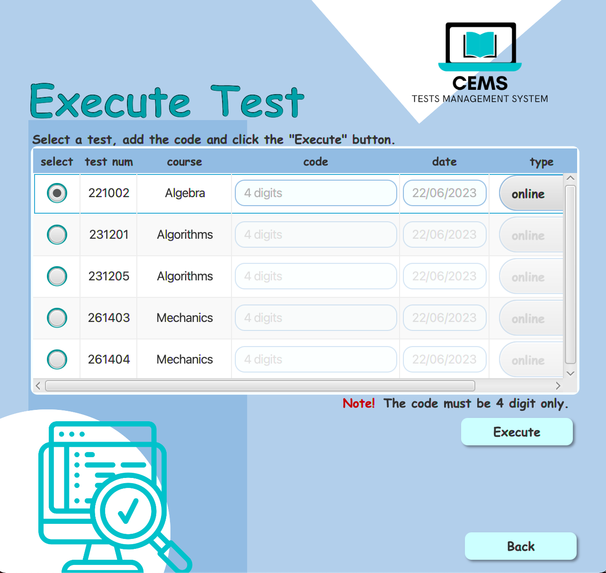

### Test Taking

- Examinees enter an execution code (provided by the lecturer) to start a test.
- Tests can be taken manually (using Word files) or via the computerized interface.
- The system measures the time allotted for each test and automatically closes it at the end.
- The lecturer can lock a test at any time, preventing new examinees from accessing it.

### Test Checking

- For computerized tests, the system grades exams based on predefined criteria.
- The lecturer can review and confirm results, adding comments or manually adjusting grades.
- Students receive their grades, checked tests, and comments via email and text messages.

### Information Processing

- The system calculates and stores statistical information about each test, including averages, medians, and score distributions (0-100).
- Automated checks identify identity errors in copies and notify the lecturer.
- Students can access their personal test scores and reviewed exams, while lecturers receive reports on tests they authored.
- The Head of the Department receives read-only access to all data and statistical reports, helping analyze grade variations among tests and students.

### Tools and Frameworks Used

- **Eclipse:** Used as the integrated development environment (IDE) for coding and managing the project.

- **MySQLWorkbench:** Employed for designing and managing the project's database, which is integral to the system.

- **Git:** Utilized for version control and collaborative development, allowing for easy tracking of code changes and team collaboration.

- **OCSF (Object Client-Server Framework):** This framework played a crucial role in implementing the client-server architecture for the computerized test taking process, ensuring efficient communication between clients and the server.

### Note

The system's handling of manual tests is not included in this README's definition.

---

The Computerized Examination Management System streamlines test creation, administration, and grading, providing valuable insights and ensuring a fair and efficient assessment process within the college. For more details on specific features, please refer to the relevant sections above.

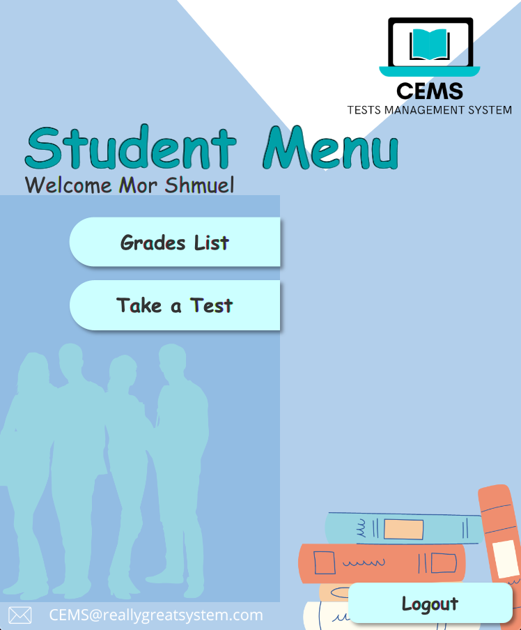

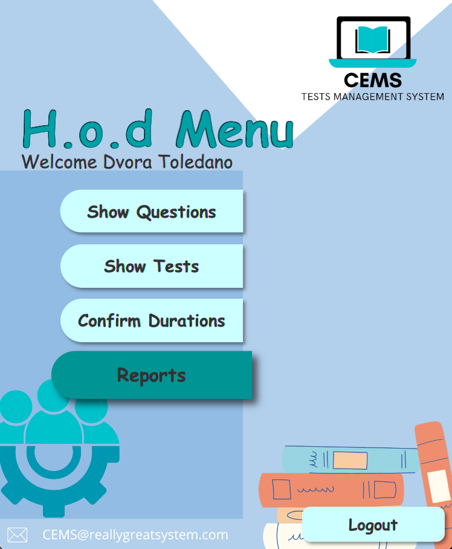

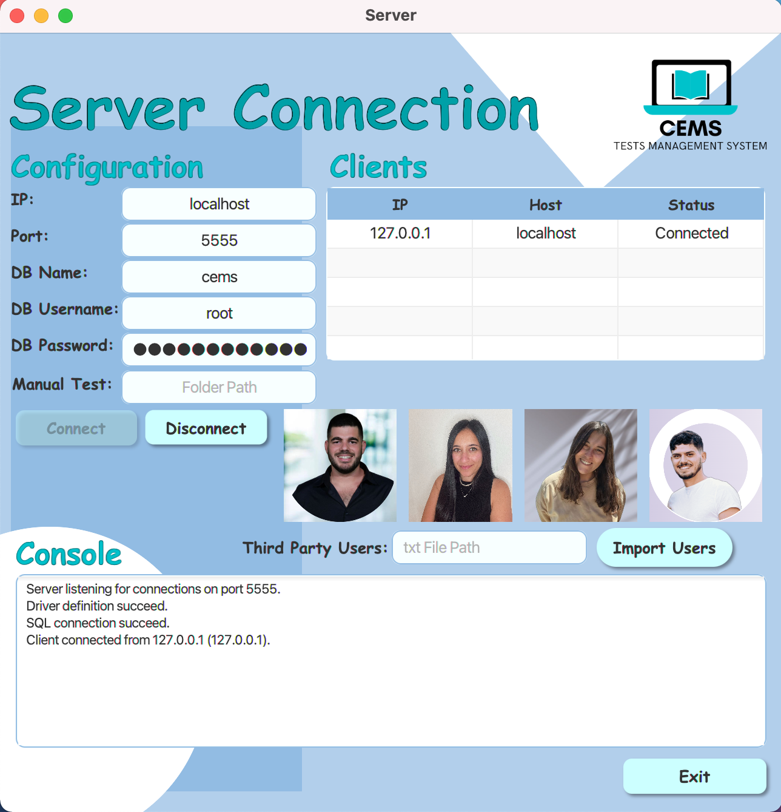
